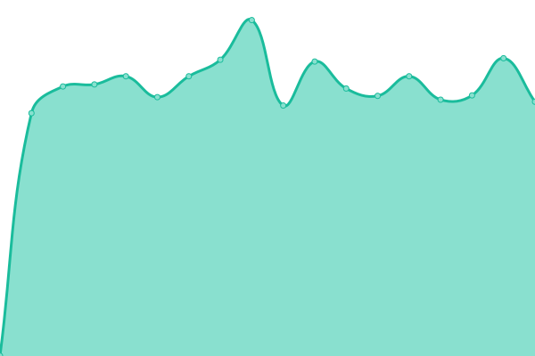
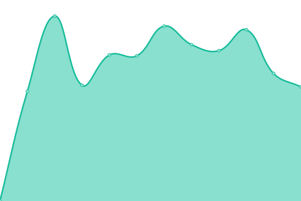
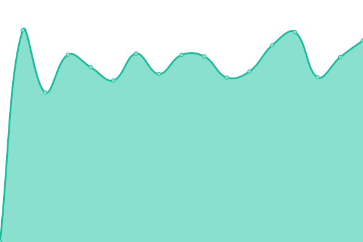
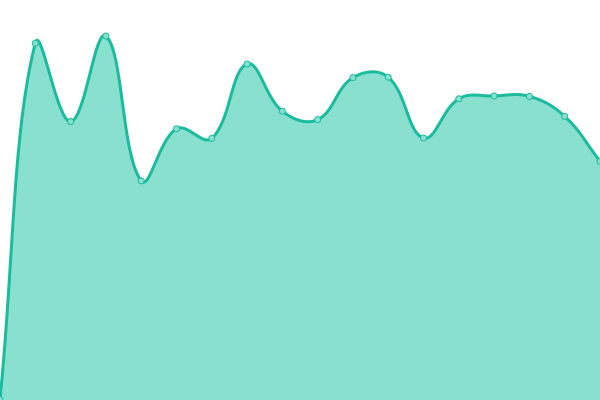
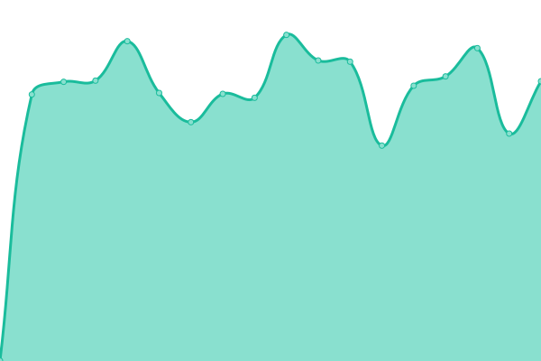
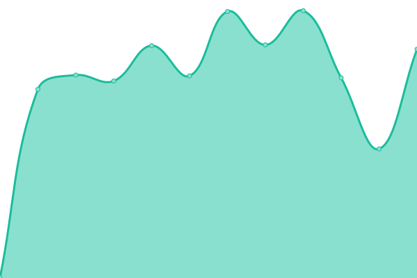
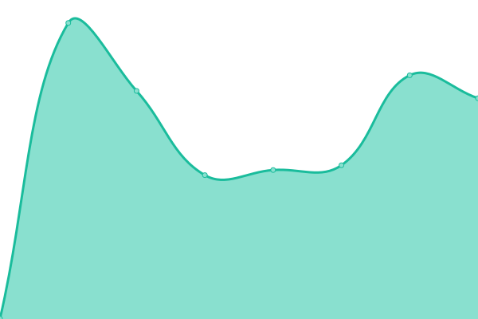

# [📈 Live Status](https://dokuwiki.github.io/status): <!--live status--> **🟩 All systems operational**

This repository contains the open-source uptime monitor and status page for [DokuWiki.org](https://www.dokuwiki.org), powered by [Upptime](https://github.com/upptime/upptime).

With [Upptime](https://upptime.js.org), you can get your own unlimited and free uptime monitor and status page, powered entirely by a GitHub repository. We use [Issues](https://github.com/dokuwiki/status/issues) as incident reports, [Actions](https://github.com/dokuwiki/status/actions) as uptime monitors, and [Pages](https://dokuwiki.github.io/status) for the status page.

<!--start: status pages-->
<!-- This summary is generated by Upptime (https://github.com/upptime/upptime) -->
<!-- Do not edit this manually, your changes will be overwritten -->
<!-- prettier-ignore -->
| URL | Status | History | Response Time | Uptime |
| --- | ------ | ------- | ------------- | ------ |
|  [Wiki](https://www.dokuwiki.org) | 🟩 Up | [wiki.yml](https://github.com/dokuwiki/status/commits/HEAD/history/wiki.yml) | 

 864ms
     
 | 

<a href="https://status.dokuwiki.org/history/wiki">90.29%</a>
    

|  [Forum](https://forum.dokuwiki.org) | 🟩 Up | [forum.yml](https://github.com/dokuwiki/status/commits/HEAD/history/forum.yml) | 

 1225ms
     
 | 

<a href="https://status.dokuwiki.org/history/forum">90.32%</a>
    

|  [Download](https://download.dokuwiki.org) | 🟩 Up | [download.yml](https://github.com/dokuwiki/status/commits/HEAD/history/download.yml) | 

 902ms
     
 | 

<a href="https://status.dokuwiki.org/history/download">90.35%</a>
    

|  [Translate](https://translate.dokuwiki.org) | 🟩 Up | [translate.yml](https://github.com/dokuwiki/status/commits/HEAD/history/translate.yml) | 

 1087ms
     
 | 

<a href="https://status.dokuwiki.org/history/translate">90.38%</a>
    

|  [IRC Log](https://irc.dokuwiki.org/) | 🟩 Up | [irc-log.yml](https://github.com/dokuwiki/status/commits/HEAD/history/irc-log.yml) | 

 717ms
     
 | 

<a href="https://status.dokuwiki.org/history/irc-log">90.41%</a>
    

|  [Code Search](https://codesearch.dokuwiki.org/) | 🟩 Up | [code-search.yml](https://github.com/dokuwiki/status/commits/HEAD/history/code-search.yml) | 

 934ms
     
 | 

<a href="https://status.dokuwiki.org/history/code-search">90.44%</a>
    

|  [Plugin Wizard](https://pluginwiz.dokuwiki.org/) | 🟩 Up | [plugin-wizard.yml](https://github.com/dokuwiki/status/commits/HEAD/history/plugin-wizard.yml) | 

 736ms
     
 | 

<a href="https://status.dokuwiki.org/history/plugin-wizard">90.47%</a>
    

|  [Mastodon](https://phpc.social/@dokuwiki) | 🟩 Up | [mastodon.yml](https://github.com/dokuwiki/status/commits/HEAD/history/mastodon.yml) | 

 774ms
     
 | 

<a href="https://status.dokuwiki.org/history/mastodon">100.00%</a>
    

<!--end: status pages-->

[**Visit our status website →**](https://dokuwiki.github.io/status)

## 📄 License

- Powered by: [Upptime](https://github.com/upptime/upptime)
- Code: [MIT](./LICENSE) © [Anand Chowdhary](https://anandchowdhary.com), supported by [Pabio](https://pabio.com)
- Data in the `./history` directory: [Open Database License](https://opendatacommons.org/licenses/odbl/1-0/)
